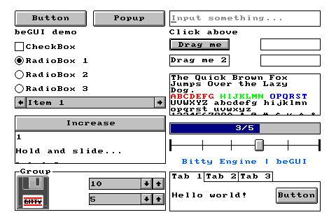
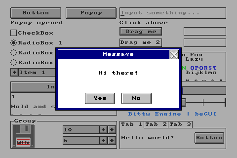
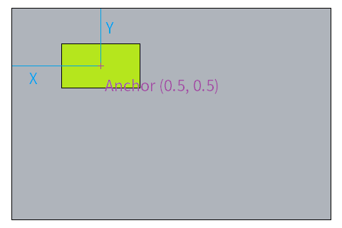
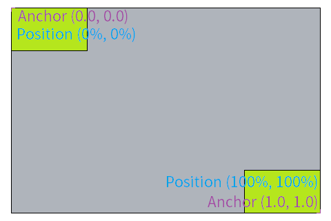
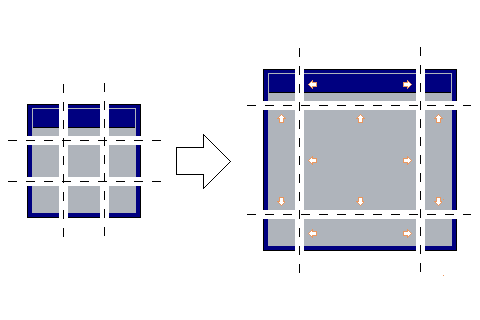

beGUI is a minimal customizable GUI system for Lua, and fully written in Lua.

Try it [in browser](https://paladin-t.github.io/begui/).

**Index**

* [Features](#features)
* [Setup](#setup)
* [Reference](#reference)
  * [1. Principles](#1-principles)
  * [2. Structures](#2-structures)
    * [beStructures.Percent](#bestructurespercent)
    * [beGUI.percent](#beguipercent)
  * [3. Widget](#3-widget)
    * [beGUI.Widget](#beguiwidget)
  * [4. Basic Widgets](#4-basic-widgets)
    * [beGUI.Label](#beguilabel)
    * [beGUI.MultilineLabel](#beguimultilinelabel)
    * [beGUI.Url](#beguiurl)
    * [beGUI.InputBox](#beguiinputbox)
    * [beGUI.Picture](#beguipicture)
    * [beGUI.Button](#beguibutton)
    * [beGUI.PictureButton](#beguipicturebutton)
    * [beGUI.CheckBox](#beguicheckbox)
    * [beGUI.RadioBox](#beguiradiobox)
    * [beGUI.ComboBox](#beguicombobox)
    * [beGUI.NumberBox](#beguinumberbox)
    * [beGUI.ProgressBar](#beguiprogressbar)
    * [beGUI.Slide](#beguislide)
    * [beGUI.Group](#beguigroup)
  * [5. Container Widgets](#5-container-widgets)
    * [beGUI.List](#beguilist)
    * [beGUI.Draggable](#beguidraggable)
    * [beGUI.Droppable](#beguidroppable)
    * [beGUI.Tab](#beguitab)
    * [beGUI.Popup](#beguipopup)
    * [beGUI.MessageBox](#beguimessagebox)
    * [beGUI.QuestionBox](#beguiquestionbox)
  * [6. Custom Widget](#6-custom-widget)
    * [beGUI.Custom](#beguicustom)
    * [Writing Your Own Widget](#writing-your-own-widget)
  * [7. Theme](#7-theme)
  * [8. Tweening](#8-tweening)
    * [beGUI.Tween](#beguitween)
* [License](#license)

# Features





"beGUI" implements:

* Placable, resizable, anchorable, and nestable `Widget`
* Textual `Label`, `MultilineLabel`, `Url`, `InputBox`
* `Picture`
* Clickable `Button`, `PictureButton`
* `CheckBox`, `RadioBox`
* `ComboBox`
* `NumberBox`
* `ProgressBar`, `Slide`
* `Group`
* Scrollable `List`
* `Draggable` and `Droppable`
* `Tab`
* `Popup`, `MessageBox`, `QuestionBox`
* `Custom` to make your own update function
* And customizable by writing your own widget
* Navigation by key (or custom method)

Play live demo [in browser](https://paladin-t.github.io/begui/).

# Setup

beGUI is originally created to run within the [Bitty Engine](https://github.com/paladin-t/bitty/). The graphics primitives and input API is quite straightforward in Bitty Engine, it's possible to port it to other Lua-based environments with little twist, if that environment does `rect(...)`, `tex(...)`, `text(...)`, `mouse(...)`, etc.

1. Clone this repository or download from [releases](https://github.com/paladin-t/begui/releases)
2. Open "src" directly or import it to your own projects with [Bitty Engine](https://github.com/paladin-t/bitty/)

# Reference

## 1. Principles

beGUI implements a [retained mode](https://en.wikipedia.org/wiki/Retained_mode) GUI system, it separates behaviour and appearance into widget classes and theme preference. Widgets are organized in tree hierarchies, each widget can have none or one parent, and none or multiple children. There are two phases of the lib, first to construct the hierarchy, second to update it. It enumerates from root widget to it's descendents during update, beGUI will handle internal states like visibility, click event, etc. then draw it properly with the theme preference during this procedure.

Most of the member functions return the widget object itself, it makes it easier to write internal DSL to construct full hierarchy in a tree style code.

```lua
require 'libs/beGUI/beGUI'

local widgets = nil
local theme = nil

function setup()
  local P = beGUI.percent -- Alias of percent.
  widgets = beGUI.Widget.new()
    :put(0, 0)
    :resize(P(100), P(100))
    :addChild(
      beGUI.Label.new('beGUI demo')
        :setId('label')
        :anchor(0, 0)
        :put(10, 10)
        :resize(100, 23)
    )
    :addChild(
      beGUI.Button.new('Button')
        :setId('button')
        :anchor(0, 0)
        :put(10, 36)
        :resize(100, 23)
        :on('clicked', function (sender)
          local lbl = widgets:find('label')
          lbl:setValue('Clicked ' .. tostring(sender))
        end)
    )
  theme = beTheme.default()
end

function update(delta)
  cls(Color.new(255, 255, 255))

  font(theme['font'].resource)
  widgets:update(theme, delta)
  font(nil)
end
```

Each widget has an anchor property which represents for the locating point in its local space, and a position property for either absolute or percentage position in its parent's space relatively. The final position is calculated according to these two properties. An anchor component is typically in range of values from 0.0 to 1.0, but it could be also less than 0.0 or greater than 1.0. A relative position component is typically in range of values from `Percent(0)` to `Percent(100)`, but it could be also less than `Percent(0)` or greater than `Percent(100)`.





Resources are splitted into nine grids evenly for flex scaled widgets.



## 2. Structures

<details open>
<summary>Structures</summary>

These structures are used to help organizing widget layout.

### beStructures.Percent

beStructures.`Percent` denotes relative value instead of absolute for positioning and sizing depending on its parent properties.

**Model: `require 'libs/beGUI/beGUI_Structures'`**

* beStructures.`Percent.new(amount)`: constructs a `Percent` object
  * `amount`: real number, no limit but often with range of values from 0 to 100
* `p.__mul(num)`: multiply the `Percent` value with another number
  * `num`: the number to multiply
  * returns result number

### beGUI.percent

Shortcut to create `Percent` object.

**Model: `require 'libs/beGUI/beGUI'`**

* beGUI.`percent(amount)`: constructs a `Percent` object
  * `amount`: real number, no limit but often with range of values from 0 to 100
  * returns `Percent`

</details>

## 3. Widget

<details open>
<summary>Widget</summary>

### beGUI.Widget

**Model: `require 'libs/beGUI/beGUI'`**

* beGUI.`Widget.new()`: constructs a `Widget` object

* `widget:setId(id)`: sets the ID of the `Widget`; an ID is used to identify a `Widget` from others for accessing
  * `id`: ID string
  * returns `self`
* `widget:get(...)`: gets a child `Widget` with the specific ID sequence
  * `...`: ID sequence of the full hierarchy path
  * returns the got `Widget` or `nil`
* `widget:find(id)`: finds the first matched `Widget` with the specific ID
  * `id`: ID string at any level of the hierarchy path
  * returns the found `Widget` or `nil`
* `widget:visible()`: gets the visibility of the `Widget`
  * returns boolean for visibility
* `widget:setVisible(val)`: sets the visibility of the `Widget`
  * `val`: whether it's visible
  * returns `self`
* `widget:capturable()`: gets the capturability of the `Widget`
  * returns boolean or string for capturability
* `widget:setCapturable(val)`: sets the capturability of the `Widget`
  * `val`: `true`, `false` or `'children'`
  * returns `self`
* `widget:anchor(x, y)`: sets the anchor of the `Widget`; anchor is used to calculate the offset when placing `Widget`
  * `x`: x position of the anchor in local space as number, typically [0.0, 1.0] for [left, right], but it could be also less than 0.0 or greater than 1.0
  * `y`: y position of the anchor in local space as number, typically [0.0, 1.0] for [top, bottom], but it could be also less than 0.0 or greater than 1.0
  * returns `self`
* `widget:offset()`: gets the offset of the `Widget`
  * returns offset `x`, `y` in world space
* `widget:put(x, y)`: sets the position of the `Widget`
  * `x`: number for absolute position; or `Percent` for relative position, typically with range of values from `Percent(0)` to `Percent(100)`, but it could be also less than `Percent(0)` or greater than `Percent(100)`
  * `y`: number for absolute position; or `Percent` for relative position, typically with range of values from `Percent(0)` to `Percent(100)`, but it could be also less than `Percent(0)` or greater than `Percent(100)`
  * returns `self`
* `widget:position()`: gets the position of the `Widget`
  * returns position `x`, `y` in local space
* `widget:worldPosition()`: gets the position of the `Widget` in world space
  * returns position `x`, `y` in world space
* `widget:resize(width, height)`: sets the size of the `Widget`
  * `width`: number for absolute size; or `Percent` for relative size, typically with range of values from `Percent(0.00...n)` to `Percent(100)`, but it could be also greater than `Percent(100)`
  * `height`: number for absolute size; or `Percent` for relative size, typically with range of values from `Percent(0.00...n)` to `Percent(100)`, but it could be also greater than `Percent(100)`
  * returns `self`
* `widget:size()`: gets the size of the `Widget`
  * returns size `width`, `height`
* `widget:alpha()`: gets the alpha value of the `Widget`
  * returns transparency number, with range of values from 0 to 255
* `widget:setAlpha(val)`: sets the alpha value of the `Widget`
  * `val`: number with range of value from 0 to 255, or nil for default (255)
  * returns `self`
* `widget:getChild(idOrIndex)`: gets the child with the specific ID or index
  * `idOrIndex`: ID string, or index number
  * returns the found child or nil
* `widget:insertChild(child, index)`: inserts a child before the specific index
  * `child`: the child `Widget` to insert
  * returns `self`
* `widget:addChild(child)`: adds a child to the end of the children list
  * `child`: the child `Widget` to add
  * returns `self`
* `widget:removeChild(childOrIdOrIndex)`: removes a child with the specific child, or its ID or index
  * `child`: child `Widget`, or its ID string, or index number
  * returns `self`
* `widget:foreachChild(handler)`: iterates all children, and calls the specific handler
  * `handler`: the children handler in form of `function (child, index) end`
  * returns `self`
* `widget:sortChildren(comp)`: sorts all children with the specific comparer
  * `comp`: the comparer in form of `function (left, right) end`
  * returns `self`
* `widget:getChildrenCount()`: gets the count of all children
  * returns children count number
* `widget:clearChildren()`: clears all children
  * returns `self`
* `widget:openPopup(content)`: opens a popup
  * `content`: the popup to open
  * returns `self`
* `widget:closePopup()`: closes any popup
  * returns `self`
* `widget:update(theme, delta, event = nil)`: updates the `Widget` and its children recursively
  * `theme`: the theme to draw with
  * `delta`: elapsed time since previous update
  * `event`: omit it for common usage, pass a prefilled event to prevent default event

* `widget:on(event, handler)`: registers the handler of the specific event
  * `event`: event name string
  * `handler`: callback function
  * returns `self`
* `widget:off(event)`: unregisters the handlers of the specific event
  * `event`: event name string
  * returns `self`

* `widget:navigatable()`: gets whether this `Widget` is navigatable
  * returns `'all'` for fully navigatable, `nil` for non-navigatable, `'children'` for children only, `'content'` for content only
* `widget:navigate(dir)`: navigates through widgets, call this to perform key navigation, etc.
  * `dir`: can be one in `'prev'`, `'next'`, `'press'`, `'cancel'`
* `widget:queriable()`: gets whether this `Widget` is queriable
  * returns `true` for queriable, otherwise `false`
* `widget:setQueriable(val)`: sets whether this `Widget` is queriable
  * `val`: whether this `Widget` is queriable
  * returns `self`
* `widget:query(x, y)`: queries a `Widget` at the specific position
  * `x`: the x position to query
  * `y`: the y position to query
  * returns the queried `Widget` or `nil`
* `widget:captured()`: gets whether this `Widget` has captured mouse event.
  * returns `true` for captured, otherwise `false`
* `widget:tween(t)`: schedules a tweening procedure
  * `t`: the tweening object
  * returns `self`
* `widget:clearTweenings()`: clears all tweening procedures
  * returns `self`

</details>

## 4. Basic Widgets

<details open>
<summary>Basic Widgets</summary>

### beGUI.Label

**Model: `require 'libs/beGUI/beGUI'`, implements beGUI.`Widget`**

* beGUI.`Label.new(content, alignment = 'left', clip_ = false, theme = nil, shadow = nil)`: constructs a `Label` with the specific content
  * `content`: the content string
  * `alignment`: one in `nil`, `'left'`, `'right'`, `'center'`
  * `clip_`: whether to clip drawing outside this `Widget`'s bounds
  * `theme`: custom theme
  * `shadow`: shadow theme for shadowed drawing

* `label:getValue()`: gets the content text
  * returns the content string
* `label:setValue(val)`: sets the content text
  * `val`: the specific content string
  * returns `self`
* `label:alignment()`: gets the alignment
  * returns the alignment preference string
* `label:setAlignment(val)`: sets the alignment preference
  * `val`: the specific alignment preference string
  * returns `self`
* `label:clipping()`: gets whether to clip drawing outside the `Widget`'s bounds
  * returns `true` for clipping, otherwise `false`
* `label:setClipping(val)`: sets whether to clip drawing outside the `Widget`'s bounds
  * `val`: `true` to clip
  * returns `self`
* `label:setTheme(theme, shadow = nil)`: sets the theme
  * `theme`: the custom theme
  * `shadow`: the custom shadow theme
  * returns `self`

### beGUI.MultilineLabel

**Model: `require 'libs/beGUI/beGUI'`, implements beGUI.`Widget`**

* beGUI.`MultilineLabel.new(content, lineHeight = nil, alighment = 'left')`: constructs a `MultilineLabel` with the specific content
  * `content`: the content string
  * `lineHeight`: the custom line height
  * `alignment`: one in `nil`, `'left'`, `'right'`, `'center'`

* `multilinelabel:getValue()`: gets the content text
  * returns the content string
* `multilinelabel:setValue(val)`: sets the content text
  * `val`: the specific content string
  * returns `self`
* `multilinelabel:lineHeight()`: gets the line height
  * returns the line height
* `multilinelabel:setLineHeight(val)`: sets the line height
  * `val`: the specific line height
  * returns `self`
* `multilinelabel:alignment()`: gets the alignment
  * returns the alignment preference string
* `multilinelabel:setAlignment(val)`: sets the alignment preference, the preference falls to `'left'` if had set flex width to `true`
  * `val`: the specific alignment preference string
  * returns `self`
* `multilinelabel:setTheme(theme)`: sets the theme
  * `theme`: the custom theme
  * returns `self`
* `multilinelabel:flexWidth()`: gets whether to calculate `Widget` width automatically
  * returns `true` for calculating automatically, otherwise `false`
* `multilinelabel:setFlexWidth(val)`: sets whether to calculate `Widget` width automatically
  * `val`: `true` to calculate automatically
  * returns `self`
* `multilinelabel:flexHeight()`: gets whether to calculate `Widget` height automatically
  * returns `true` for calculating automatically, otherwise `false`
* `multilinelabel:setFlexHeight(val)`: sets whether to calculate `Widget` height automatically
  * `val`: `true` to calculate automatically
  * returns `self`

### beGUI.Url

**Model: `require 'libs/beGUI/beGUI'`, implements beGUI.`Widget`**

* beGUI.`Url.new(content, alighment = 'left', clip_ = false, theme = nil)`: constructs a `Url` with the specific content
  * `content`: the content string
  * `alignment`: one in `nil`, `'left'`, `'right'`, `'center'`
  * `clip_`: whether to clip drawing outside this `Widget`'s bounds
  * `theme`: custom theme

* `url:getValue()`: gets the content text
  * returns the content string
* `url:setValue(val)`: sets the content text
  * `val`: the specific content string
  * returns `self`
* `url:alignment()`: gets the alignment
  * returns the alignment preference string
* `url:setAlignment(val)`: sets the alignment preference
  * `val`: the specific alignment preference string
  * returns `self`
* `url:clipping()`: gets whether to clip drawing outside the `Widget`'s bounds
  * returns `true` for clipping, otherwise `false`
* `url:setClipping(val)`: sets whether to clip drawing outside the `Widget`'s bounds
  * `val`: `true` to clip
  * returns `self`
* `url:setTheme(theme)`: sets the theme
  * `theme`: the custom theme
  * returns `self`

* `url:on('clicked', function (sender) end)`: registers an event which will be triggered when the `Widget` has been clicked
  * returns `self`

### beGUI.InputBox

**Model: `require 'libs/beGUI/beGUI'`, implements beGUI.`Widget`**

* beGUI.`InputBox.new(content placeholder)`: constructs an InputBox with the specific content
  * `content`: the content string
  * `placeholder`: the placeholder string when there's no input yet

* `inputbox:getValue()`: gets the content text
  * returns the content string
* `inputbox:setValue(val)`: sets the content text
  * `val`: the specific content string
* `inputbox:placeholder()`: gets the placeholder text
  * returns the placeholder string
* `inputbox:setPlaceholder(val)`: sets the placeholder text
  * `val`: the specific placeholder string
  * returns `self`

* `inputbox:on('changed', function (sender, value) end)`: registers an event which will be triggered when the `Widget` content text has been changed
  * returns `self`

### beGUI.Picture

**Model: `require 'libs/beGUI/beGUI'`, implements beGUI.`Widget`**

* beGUI.`Picture.new(content, stretched = false, permeation = false)`: constructs a Picture with the specific content
  * `content`: the content `Texture`
  * `stretched`: whether to use 9-grid-based splitting for stretching
  * `permeation`: whether to use permeation correction

* `picture:setValue(content, stretched = false, permeation = false)`: sets the content `Texture`
  * `content`: the content `Texture`
  * returns `self`
* `picture:stretched()`: gets whether to use 9-grid-based splitting for stretching
  * returns `true` for 9-grid-based splitting, otherwise `false`
* `picture:setStretched(val)`: sets whether to use 9-grid-based splitting for stretching
  * `val`: `true` to use 9-grid-based splitting for stretching
  * returns `self`
* `picture:permeation()`: gets whether to use permeation correction
  * returns `true` for permeation correction, otherwise `false`
* `picture:setPermeation(val)`: sets whether to use permeation correction
  * `val`: `true` to use permeation correction
  * returns `self`
* `picture:color()`: gets the mask color of the `Picture`
  * returns the mask color or `nil`
* `picture:setColor(val)`: sets the mask color of the `Picture`
  * `val`: the specific mask color
  * returns `self`

### beGUI.Button

**Model: `require 'libs/beGUI/beGUI'`, implements beGUI.`Widget`**

* beGUI.`Button.new(content)`: constructs a Button with the specific content
  * `content`: the content string

* `button:setValue(content)`: sets the content text
  * `val`: the specific content string
* `button:setTheme(themeNormal, themeDown, themeDisabled)`: sets the theme
  * `themeNormal`: the custom theme for normal state
  * `themeDown`: the custom theme for pressed state
  * `themeDisabled`: the custom theme for disabled state
  * returns `self`
* `button:enabled()`: gets whether this `Widget` is enabled
  * returns `true` for enabled, otherwise `false`
* `button:setEnabled(val)`: sets whether this `Widget` is enabled
  * `val`: `true` for enabled, otherwise `false`
  * returns `self`

* `button:on('clicked', function (sender) end)`: registers an event which will be triggered when the `Widget` has been clicked
  * returns `self`

### beGUI.PictureButton

**Model: `require 'libs/beGUI/beGUI'`, implements beGUI.`Widget`**

* beGUI.`PictureButton.new(content, repeat_ = false, theme = nil, background = nil)`: constructs a `PictureButton` with the specific content
  * `content`: the content `Texture`
  * `repeat_`: whether to enable repeating event
  * `theme`: the custom theme
  * `background`: optional, the custom background `Texture`

* `picturebutton:enabled()`: gets whether this `Widget` is enabled
  * returns `true` for enabled, otherwise `false`
* `picturebutton:setEnabled(val)`: sets whether this `Widget` is enabled
  * `val`: `true` for enabled, otherwise `false`
  * returns `self`

* `picturebutton:on('clicked', function (sender) end)`: registers an event which will be triggered when the `Widget` has been clicked
  * returns `self`

### beGUI.CheckBox

**Model: `require 'libs/beGUI/beGUI'`, implements beGUI.`Widget`**

* beGUI.`CheckBox.new(content, value = false)`: constructs a `CheckBox` with the specific content
  * `content`: the content string
  * `value`: the initial checked state

* `checkbox:getValue()`: gets whether this `Widget` is checked
  * returns `true` for checked, otherwise `false`
* `checkbox:setValue(val)`: sets whether this `Widget` is checked
  * `val`: `true` for checked, otherwise `false`
  * returns `self`

* `checkbox:on('changed', function (sender, value) end)`: registers an event which will be triggered when the `Widget` checked state has been changed
  * returns `self`

### beGUI.RadioBox

**Model: `require 'libs/beGUI/beGUI'`, implements beGUI.`Widget`**

* beGUI.`RadioBox.new(content, value = false)`: constructs a `RadioBox` with the specific content
  * `content`: the content string
  * `value`: the initial checked state

* `radiobox:getValue()`: gets whether this `Widget` is checked
  * returns `true` for checked, otherwise `false`
* `radiobox:setValue(val)`: sets whether this `Widget` is checked; not recommended to call this manually
  * `val`: `true` for checked, otherwise `false`

* `radiobox:on('changed', function (sender, value) end)`: registers an event which will be triggered when the `Widget` checked state has been changed
  * returns `self`

### beGUI.ComboBox

**Model: `require 'libs/beGUI/beGUI'`, implements beGUI.`Widget`**

* beGUI.`ComboBox.new(content, value = nil)`: constructs a `ComboBox` with the specific content
  * `content`: list of string
  * `value`: the selected index number

* `combobox:getItemAt(index)`: gets the item text at the specific index
  * `index`: the specific index to get
  * returns got item string or `nil`
* `combobox:addItem(item)`: adds an item string with the specific content text
  * `item` the specific item text to add
  * returns `self`
* `combobox:removeItemAt(index)`: removes the item at the specific index
  * `index` the specific index to remove
  * returns `true` for success, otherwise `false`
* `combobox:clearItems()`: clears all items
  * returns `self`
* `combobox:getValue()`: gets the selected index
  * returns the selected index number
* `combobox:setValue(val)`: sets the selected index
  * `val`: the specific selected index
  * returns `self`

* `combobox:on('changed', function (sender, value) end)`: registers an event which will be triggered when the `Widget` selection state has been changed
  * returns `self`

### beGUI.NumberBox

**Model: `require 'libs/beGUI/beGUI'`, implements beGUI.`Widget`**

* beGUI.`NumberBox.new(value, step, min = nil, max = nil, trim = nil, format = nil)`: constructs a `NumberBox` with the specific value
  * `value`: the initial value number
  * `step`: the changing step
  * `min`: the minumum limit
  * `max`: the maximum limit
  * `trim`: optional, used to trim before value setting
  * `format`: optional, used to format value for output

* `numberbox:getValue()`: gets the value number
  * returns the value number
* `numberbox:setValue(val)`: sets the value number
  * `val`: the specific value number
  * returns `self`
* `numberbox:getMinValue()`: gets the minimum limit number
  * returns the minimum limit number
* `numberbox:setMinValue(val)`: sets the minimum limit number
  * `val`: the specific minimum limit number
  * returns `self`
* `numberbox:getMaxValue()`: gets the maximum limit number
  * returns the maximum limit number
* `numberbox:setMaxValue(val)`: sets the maximum limit number
  * `val`: the specific maximum limit number
  * returns `self`
* `numberbox:step()`: gets the changing step
  * returns the changing step
* `numberbox:setStep(val)`: sets the changing step
  * `val`: the specific changing step number
  * returns `self`
* `numberbox:trim()`: gets the trim function
  * returns the trim function
* `numberbox:setTrim(val)`: sets the trim function
  * `val`: the specific trim function
  * returns `self`
* `numberbox:format()`: gets the format function
  * returns the format function
* `numberbox:setFormat(val)`: sets the format function
  * `val`: the specific format function
  * returns `self`
* `numberbox:setValueTheme(val)`: sets the value theme
  * `val`: the specific theme
  * returns `self`

* `numberbox:on('changed', function (sender, value) end)`: registers an event which will be triggered when the `Widget` value has been changed
  * returns `self`

### beGUI.ProgressBar

**Model: `require 'libs/beGUI/beGUI'`, implements beGUI.`Widget`**

* beGUI.`ProgressBar.new(max, color, increasing = 'right')`: constructs a `ProgressBar`
  * `max`: the maximum value
  * `color`: the color for the completed bar
  * `increasing`: indicates whether to increase from left to right, or reversed, one in `'left'`, `'right'`

* `progressbar:getValue()`: gets the value number
  * returns the value number
* `progressbar:setValue(val)`: sets the value number
  * `val`: the specific value number
  * returns `self`
* `progressbar:getMaxValue()`: gets the maximum limit number
  * returns the maximum limit number
* `progressbar:setMaxValue(val)`: sets the maximum limit number
  * `val`: the specific maximum limit number
  * returns `self`
* `progressbar:getShadowValue()`: gets the shadow value number
  * returns the value number
* `progressbar:setShadowValue(val)`: sets the shadow value number
  * `val`: the specific shadow value number
  * returns `self`
* `progressbar:setTheme(theme)`: sets the theme
  * `theme`: the custom theme
  * returns `self`

* `progressbar:on('changed', function (sender, value, maxValue, shadowValue) end)`: registers an event which will be triggered when the `Widget` value has been changed
  * returns `self`

### beGUI.Slide

**Model: `require 'libs/beGUI/beGUI'`, implements beGUI.`Widget`**

* beGUI.`Slide.new(value, min, max)`: constructs a `Slide` with the specific value
  * `value`: the initial value number
  * `min`: the minimum limit number
  * `max`: the maximum limit number

* `slide:getValue()`: gets the value number
  * returns the value number
* `slide:setValue(val)`: sets the value number
  * `val`: the specific value number
  * returns `self`
* `slide:getMinValue()`: gets the minimum limit number
  * returns the minimum limit number
* `slide:setMinValue(val)`: sets the minimum limit number
  * `val`: the specific minimum limit number
  * returns `self`
* `slide:getMaxValue()`: gets the maximum limit number
  * returns the maximum limit number
* `slide:setMaxValue(val)`: sets the maximum limit number
  * `val`: the specific maximum limit number
  * returns `self`

* `slide:on('changed', function (sender, value) end)`: registers an event which will be triggered when the `Widget` value has been changed
  * returns `self`

### beGUI.Group

**Model: `require 'libs/beGUI/beGUI'`, implements beGUI.`Widget`**

* beGUI.`Group.new(content)`: constructs a `Group`
  * `content`: the content string

* `group:getValue()`: gets the content text
  * returns the content string
* `group:setValue(val)`: sets the content text
  * `val`: the specific content string
  * returns `self`

</details>

## 5. Container Widgets

<details open>
<summary>Container Widgets</summary>

### beGUI.List

**Model: `require 'libs/beGUI/beGUI'`, implements beGUI.`Widget`**

* beGUI.`List.new(withScrollBar = false)`: constructs a `List`
  * `withScrollBar`: whether to draw scroll bar(s)

* `list:scrollableHorizontally()`: gets whether to allow scrolling horizontally
  * returns `true` for allowing scrolling horizontally, otherwise `false`
* `list:setScrollableHorizontally(val)`: sets whether to allow scrolling horizontally
  * `val`: `true` for allowing scrolling horizontally, otherwise `false`
  * returns `self`
* `list:scrollSpeed()`: gets the scroll speed
  * returns the scroll speed
* `list:setScrollSpeed(val)`: sets the scroll speed
  * `val`: the specific scroll speed
  * returns `self`
* `list:clipping()`: gets the current clipping area
  * returns the current clipping `x`, `y`, `w`, `h`
* `list:setTheme(theme)`: sets the theme
  * `theme`: the custom theme
  * returns `self`

### beGUI.Draggable

**Model: `require 'libs/beGUI/beGUI'`, implements beGUI.`Widget`**

* beGUI.`Draggable.new()`: constructs a `Draggable`

### beGUI.Droppable

**Model: `require 'libs/beGUI/beGUI'`, implements beGUI.`Widget`**

* beGUI.`Droppable.new()`: constructs a `Droppable`

* `droppable:on('entered', function (sender, draggable) end)`: registers an event which will be triggered when the `Widget` has been entered by a `Draggable`
  * returns `self`
* `droppable:on('left', function (sender, draggable) end)`: registers an event which will be triggered when the `Widget` has been left by a `Draggable`
  * returns `self`
* `droppable:on('dropping', function (sender, draggable) return droppable end)`: registers an event which will be triggered when the `Widget` has been hovering by a `Draggable`
  * returns `self`
* `droppable:on('dropped', function (sender, draggable) end)`: registers an event which will be triggered when the `Widget` has been dropped by a `Draggable`
  * returns `self`
* `droppable:on('clicked', function (sender) end)`: registers an event which will be triggered when the `Widget` has been clicked
  * returns `self`

### beGUI.Tab

**Model: `require 'libs/beGUI/beGUI'`, implements beGUI.`Widget`**

* beGUI.`Tab.new()`: constructs a `Tab`

* `tab:add(title)`: adds a `Tab` page with the specific title
  * `title`: the `Tab` page title to add
  * returns `self`
* `tab:count()`: gets the page count of the `Tab` `Widget`
  * returns the `Tab` page count
* `tab:getValue()`: gets the active page index
  * returns the active page index number
* `tab:setValue(val)`: sets the active page index
  * `val`: the specific page index
  * returns `self`
* `tab:tabSize()`: gets the specified `Tab` size
  * returns the specified `Tab` size
* `tab:setTabSize(val)`: sets the specified `Tab` size
  * `val`: the specified `Tab` size
  * returns `self`

* `tab:on('changed', function (sender, value) end)`: registers an event which will be triggered when the `Widget` page has been switched
  * returns `self`

### beGUI.Popup

**Model: `require 'libs/beGUI/beGUI'`, implements beGUI.`Widget`**

* beGUI.`Popup.new()`: constructs a `Popup`

### beGUI.MessageBox

**Model: `require 'libs/beGUI/beGUI'`, implements beGUI.`Popup`**

* beGUI.`MessageBox.new(closable, title, message, confirm = 'OK')`: constructs a `MessageBox`
  * `closable`: `true` to enable the close button, `false` to disable
  * `title`: the title text
  * `message`: the message text
  * `confirm`: the text for the confirm button

* `messagebox:on('canceled', function (sender) end)`: registers an event which will be triggered when the `Popup` has been canceled
  * returns `self`
* `messagebox:on('confirmed', function (sender) end)`: registers an event which will be triggered when the `Popup` has been confirmed
  * returns `self`

### beGUI.QuestionBox

**Model: `require 'libs/beGUI/beGUI'`, implements beGUI.`Popup`**

* beGUI.`QuestionBox.new(closable, title, messsage, confirm, deny)`: constructs a `QuestionBox`
  * `closable`: `true` to enable the close button, `false` to disable
  * `title`: the title text
  * `message`: the message text
  * `confirm`: the text for the confirm button
  * `deny`: the text for the deny button

* `questionbox:on('canceled', function (sender) end)`: registers an event which will be triggered when the `Popup` has been canceled
  * returns `self`
* `questionbox:on('confirmed', function (sender) end)`: registers an event which will be triggered when the `Popup` has been confirmed
  * returns `self`
* `questionbox:on('denied', function (sender) end)`: registers an event which will be triggered when the `Popup` has been denied
  * returns `self`

</details>

## 6. Custom Widget

<details open>
<summary>Custom Widget</summary>

There are two ways to customize your own `Widget`, one is to use the beWidget.`Custom` `Widget`, the other is to write your own `Widget` class.

### beGUI.Custom

The `Custom` `Widget` exposes a `'updated'` event to let you write short customized update routine in the callback.

**Model: `require 'libs/beGUI/beGUI'`, implements beGUI.`Widget`**

* beGUI.`Custom.new(name = 'Custom')`: constructs a `Custom` `Widget`
  * `name`: the custom `Widget` name used to perform `__tostring`

* `custom:name()`: gets the custom `Widget` name
  * returns the custom `Widget` name
* `custom:setName(val)`: sets the custom `Widget` name
  * `val`: the specific custom `Widget` name
  * returns `self`

* `custom:on('updated', function (sender, x, y, w, h, delta) end)`: registers an event which will be triggered when the `Widget` has been updated per frame
  * returns `self`

### Writing Your Own Widget

You can also write your own `Widget` inheriting from beWidget.`Widget`.

```lua
local beClass = require 'libs/beGUI/beClass'
local beUtils = require 'libs/beGUI/beGUI_Utils'
local beWidget = require 'libs/beGUI/beGUI_Widget'

local MyWidget = beClass.class({
  _value = nil, -- Define your fields.
  _pressed = false,

  ctor = function (self, ...)
    beWidget.Widget.ctor(self)

    -- Customize your constructor.
  end,

  __tostring = function (self)
    return 'MyWidget'
  end,

  getValue = function (self) -- Define your properties.
    return self._value
  end,
  setValue = function (self, val)
    if self._value == val then
      return self
    end
    self._value = val
    self:_trigger('changed', self, self._value)

    return self
  end,

  _update = function (self, theme, delta, dx, dy, event)
    -- Ignore if invisible.
    if not self.visibility then
      return
    end

    -- Get the offset x, y, which is calculated by this widget's size and its anchor.
    local ox, oy = self:offset()
    -- Get the position x, y in local space.
    local px, py = self:position()
    -- Calculate the final position with the delta position, offset and local position,
    -- where the delta position (`dx`, `dy`) is from this widget's parent, or 0, 0 for root widget.
    local x, y = dx + px + ox, dy + py + oy
    -- Get the size width, height of this widget.
    local w, h = self:size()

    -- The following code detects clicking.
    local down = false
    if event.context.active and event.context.active ~= self then
      self._pressed = false
    elseif event.canceled or event.context.dragging then
      event.context.active = nil
      self._pressed = false
    elseif self._pressed then
      down = event.mouseDown
    else
      -- Intersection detection.
      down = event.mouseDown and Math.intersects(event.mousePosition, Rect.byXYWH(x, y, w, h))
    end
    if down and not self._pressed then
      event.context.active = self
      self._pressed = true
    elseif not down and self._pressed then
      event.context.active = nil
      self._pressed = false
      event.context.focus = self
      self:_trigger('clicked', self) -- Trigger 'clicked' event by clicking.
    elseif event.context.focus == self and event.context.navigated == 'press' then
      self:_trigger('clicked', self) -- Trigger 'clicked' event by key navigation.
      event.context.navigated = false
    end

    -- Draw the widget.
    local elem = down and theme['button_down'] or theme['button'] -- Using the button theme.
    beUtils.tex9Grid(elem, x, y, w, h, nil, self.transparency, nil) -- Draw texture.
    beUtils.textCenter(self._value, theme['font'], x, y, w, h, elem.content_offset, self.transparency) -- Draw text.

    -- Call base update to update its children.
    beWidget.Widget._update(self, theme, delta, dx, dy, event)
  end
}, beWidget.Widget)
```

</details>

## 7. Theme

<details open>
<summary>Theme</summary>

Defined in "src/libs/beGUI/beTheme.lua". Widget classes will lookup for image resources, client area, content offset, fonts, colors and all other appearance preferences from it.

</details>

## 8. Tweening

<details open>
<summary>Tweening</summary>

beGUI is integrated with a tweening lib adapted from [kikito/tween.lua](https://github.com/kikito/tween.lua), which allows to create tweening animations.

### beGUI.Tween

**Model: `require 'libs/beGUI/beGUI'`**

* beGUI.`Tween.new(duration, subject, target, easing, loop)`: constructs a `Tween` object
  * `duration`: the duration in seconds
  * `subject`: the tweening subject
  * `target`: the tweening target
  * `easing`: the easing function
  * `loop`: whether to loop the tweening

* `tween:reset()`: resets the `Tween` object
  * returns `self`
* `tween:set(clock)`: sets the `Tween` object to a specific clock point
  * `clock`: the click time point
  * returns `true` for success, otherwise `false`
* `tween:update(delta)`: updates the `Tween` object with a specific delta time in seconds
  * returns `true` for success, otherwise `false`

* `tween:on('changed', function (sender) end)`: registers an event which will be triggered when the `Tween` has been updated
  * returns `self`
* `tween:on('completed', function (sender) end)`: registers an event which will be triggered when the `Tween` has completed or looped
  * returns `self`
* `tween:off(event)`: unregisters the handlers of the specific event
  * `event`: event name string
  * returns `self`

</details>

# License

beGUI is distributed under the MIT license.
